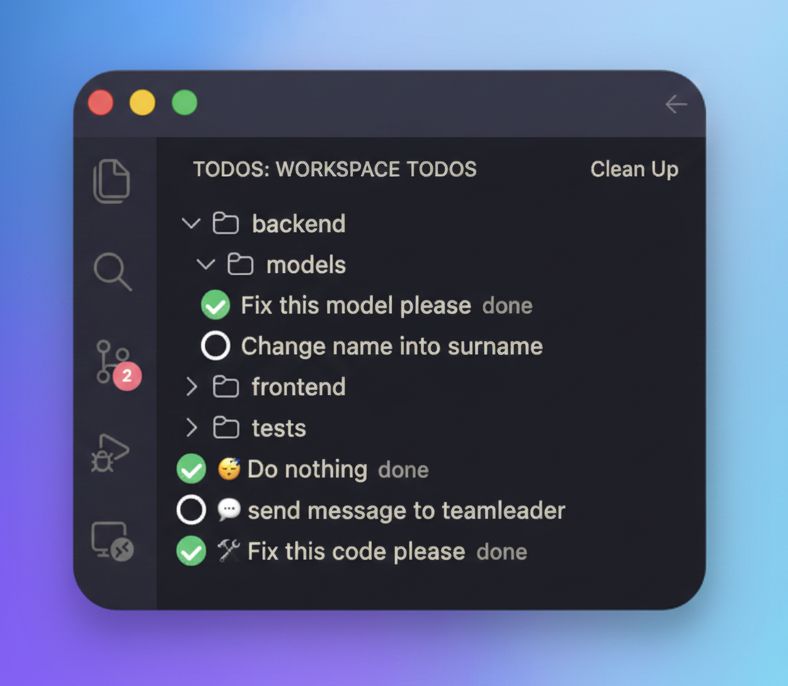
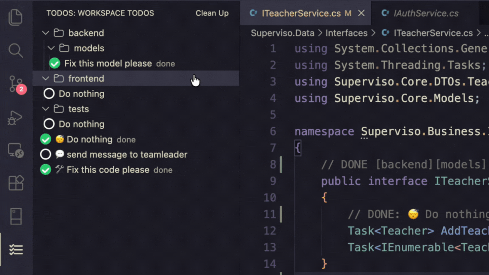
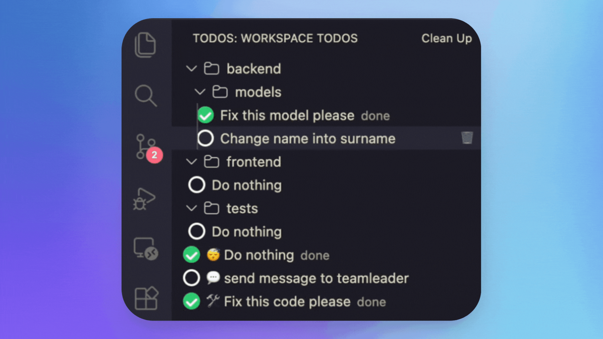
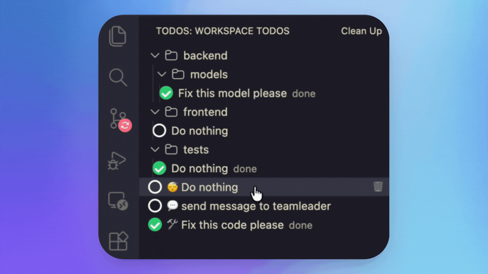

# Todoly

A lean TODO sidebar for Visual Studio Code.



Todoly scans your workspace for `// TODO:` and `// DONE:` comments and displays them in a structured tree view.

## Features

- 📂 Group TODOs by tags using `[tag]` syntax
- ✅ Toggle TODO ↔ DONE directly from the sidebar
- 🧹 Clean up completed tasks
- 🎯 Jump to source by clicking a task
- 💡 Minimal, distraction-free UI

## Usage

Write TODOs in your code like this:

```ts
// TODO [backend][models]: Fix this model
// DONE [frontend]: Polish UI
```

Tags create folders in the sidebar.
Multiple tags create nested folders.

## Actions
Most extensions are very susppicious or not very clear about what they do. Watch here how the experience looks like and how clean it is.

### Toggle TODO — mark task as done / undone
---


### Delete task — remove a TODO comment
---


### Clean up — delete all completed tasks
---
